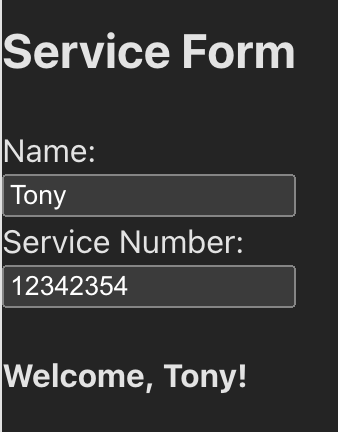

# Repair Company Service Form

A React app for a repair company that remembers the service form after a page refresh. Form values are stored in the browser with `localStorage` instead of a database, using a custom hook called `useLocalStorage`.

## Features

- Enter a **name** and **service number** in the form
- Refresh the page and see the same values still in the inputs
- Data is saved in the user's browser (`localStorage`), not in `db.json`

## How it works

`useLocalStorage(key, initialValue)` behaves like `useState`, but also:

1. Reads the starting value from `localStorage.getItem(key)` when the component mounts
2. Writes updates with `localStorage.setItem(key, value)` inside a `useEffect`

The form uses:

- `"name"` for the name field
- `"serviceNumber"` for the service number field

## Getting started

```sh
npm install
npm run dev
```

Open the URL Vite prints in the terminal (usually `http://localhost:5173`).

## Tests

```sh
npm run test
```

## Screenshot

The service form with a name and service number filled in. After a refresh, these values stay in the inputs.



## Tech

- React
- Vite
- Custom hooks (`useState`, `useEffect`, `localStorage`)
